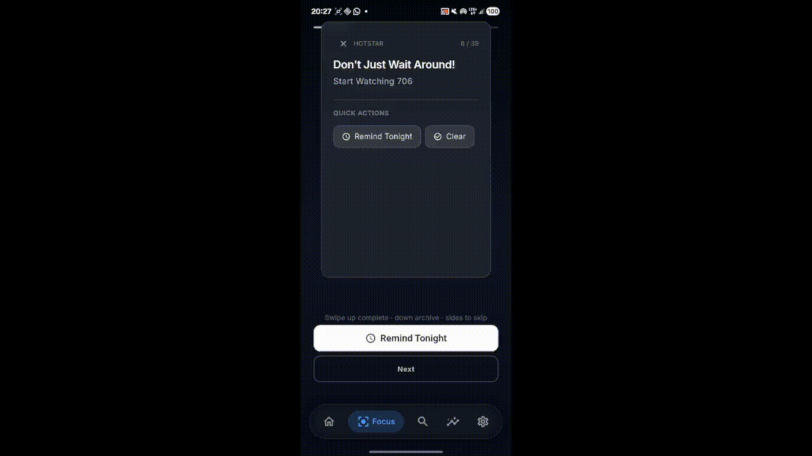
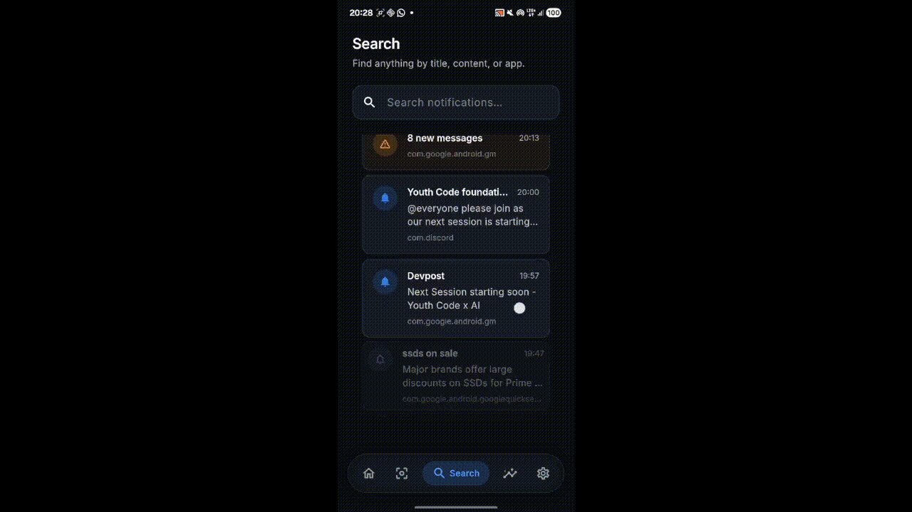
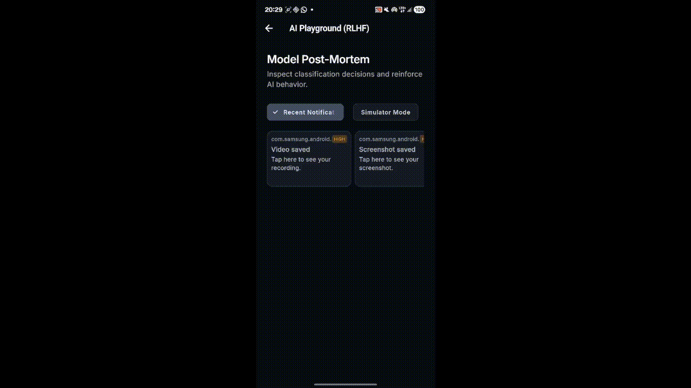
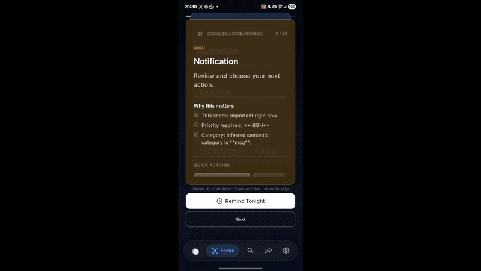

# SCOPE (Smart Contextual Opportunity & Priority Engine)

**SCOPE** is an AI-powered attention management system for Android. It acts as a premium "AttentionOS" layer, identifying and resurfacing critical government, financial, and educational alerts that are often buried under everyday notification noise.

## 📸 See it in Action

Here are some highlights of SCOPE's premium motion design and core features:

<table style="width:100%">
  <tr>
    <td align="center"><br><b>Focus Session</b></td>
    <td align="center"><br><b>Ghost AI Insights</b></td>
  </tr>
  <tr>
    <td align="center"><br><b>Ghost AI Playground</b></td>
    <td align="center"><br><b>Focus Area Filters</b></td>
  </tr>
</table>


## 🚀 Features

- **Ghost AI Engine**: A hybrid local machine learning pipeline featuring a deterministic rule engine, WordPiece NLP tokenization, and a quantized TensorFlow Lite (LiteRT) Multi-Layer Perceptron (MLP) model. Ghost AI scores and classifies incoming notifications instantly without relying on the cloud.
- **Review Queue System**: A state-machine-driven queue that actively syncs with the Android notification panel, allowing you to seamlessly Snooze, Archive, and Review alerts.
- **Immersive Focus Mode**: A beautiful, distraction-free vertical swipe interface (similar to Instagram Reels) to focus strictly on important tasks one by one.
- **Premium UI/UX**: Built with a custom glassmorphic motion design system, featuring physics-based spring animations, adaptive priority cards (glow effects for critical alerts), and interactive Daily Timeline insights.
- **Privacy-First**: A persistent, fully local SQLite database (powered by Drift) securely manages all notification ingestion, telemetry, and expiry natively on-device.

## 🛠 Tech Stack

- **Frontend**: Flutter & Dart
- **Backend / Storage**: SQLite via Drift
- **Machine Learning**: TensorFlow Lite, Python (for training pipeline)
- **Native Android**: Kotlin (NotificationListenerService)

## 🏁 Getting Started

### Prerequisites

To build and run this project, you will need:
- [Flutter SDK](https://docs.flutter.dev/get-started/install) (latest stable)
- [Android Studio](https://developer.android.com/studio) (for Android toolchain and emulator)
- Python 3.8+ (if you want to train the ML model)

### Installation

1. **Clone the repository**
   ```bash
   git clone https://github.com/yourusername/scope.git
   cd scope
   ```

2. **Install Flutter dependencies**
   ```bash
   flutter pub get
   ```

3. **Run the build runner (for Drift DB & Freezed models)**
   ```bash
   flutter pub run build_runner build --delete-conflicting-outputs
   ```

4. **Run the App**
   ```bash
   flutter run
   ```

> **⚠️ IMPORTANT:** Upon first launch, you will be prompted to grant **Notification Access** permissions. This is required for SCOPE to read and manage incoming notifications.

## 🧠 Machine Learning Pipeline

SCOPE uses a local TensorFlow Lite model. The training pipeline is located in the `ml/` directory (if applicable).
To retrain or update the model:
1. Navigate to the ML folder: `cd ml/`
2. Install requirements: `pip install -r requirements.txt`
3. Run the training script: `python train.py`
4. The output `model.tflite` will be automatically copied to the Flutter assets folder.

## 📁 Project Structure

```
scope/
├── android/          # Native Kotlin code (NotificationListenerService)
├── assets/           # TFLite models, fonts, and images
├── lib/
│   ├── core/         # Ghost AI Engine, DB setup, smart actions
│   ├── models/       # Data models and DTOs
│   ├── screens/      # Main UI screens (Insights, Focus, Shell)
│   └── widgets/      # Reusable UI components (Glassmorphic cards, animations)
├── temp/             # Temporary files and demo videos
└── pubspec.yaml      # Flutter dependencies
```

## 🤝 Contributing

Contributions, issues, and feature requests are welcome!
Feel free to check the [issues page](https://github.com/yourusername/scope/issues).

## 📝 License

This project is open-source and available under the [MIT License](LICENSE).
